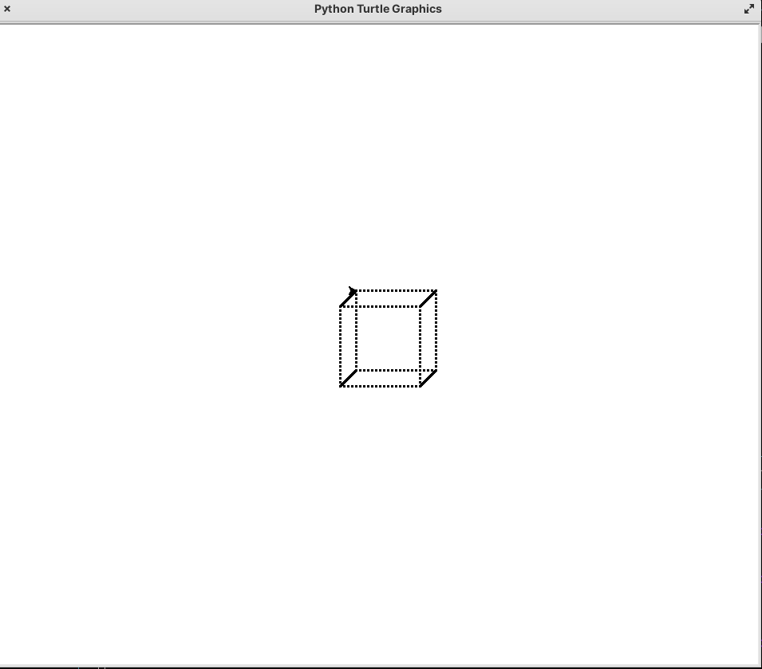

# Proyecto: Dibujo de un Cubo en 3D con Turtle

Este proyecto utiliza la biblioteca `turtle` de Python para dibujar un cubo en 3D empleando solo puntos y líneas.

## Instalación

### 1. Crear un entorno virtual (opcional pero recomendado)

Ejecuta el siguiente comando en la terminal:

```sh
python -m venv mi_entorno
```

### 2. Activar el entorno virtual

**En Windows:**

```sh
mi_entorno\Scripts\activate
```

**En Mac/Linux:**

```sh
source mi_entorno/bin/activate
```

### 3. Instalar dependencias

En la mayoría de los casos, `turtle` ya está incluido en Python, pero `tkinter` puede ser necesario. Instálalo con:

**Ubuntu/Debian:**

```sh
sudo apt install python3-tk
```

**Arch Linux:**

```sh
sudo pacman -S tk
```

**Fedora:**

```sh
sudo dnf install python3-tkinter
```

## Uso

Para ejecutar el script, simplemente usa:

```sh
python3 cubo.py
```

Esto abrirá una ventana de `turtle` donde se dibujará el cubo.

